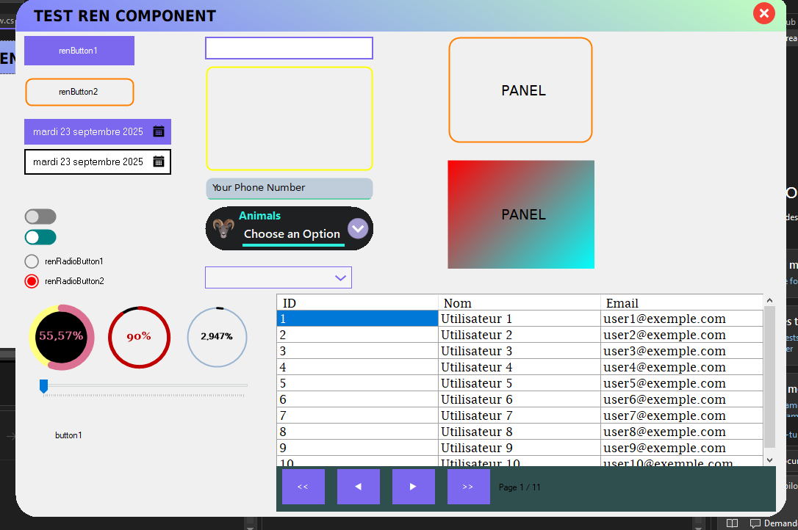

# 📘 README – RenComponent

## 🚀 Présentation

**RenComponent** est une librairie de composants personnalisés pour **Windows Forms (.NET Framework / .NET WinForms)**.
Elle permet d’avoir des contrôles modernes, stylisés et facilement réutilisables (boutons arrondis, DataGridView paginé, ComboBox custom, ProgressBar circulaire, etc.).

---

## 🚀 Overview

**RenComponent** is a custom **Windows Forms (.NET Framework / .NET WinForms)** UI library.
It provides modern, stylish, and reusable controls such as rounded buttons, a paginated DataGridView, custom ComboBoxes, circular progress bars, and more.

---

## ⚜ Resultat / Result

